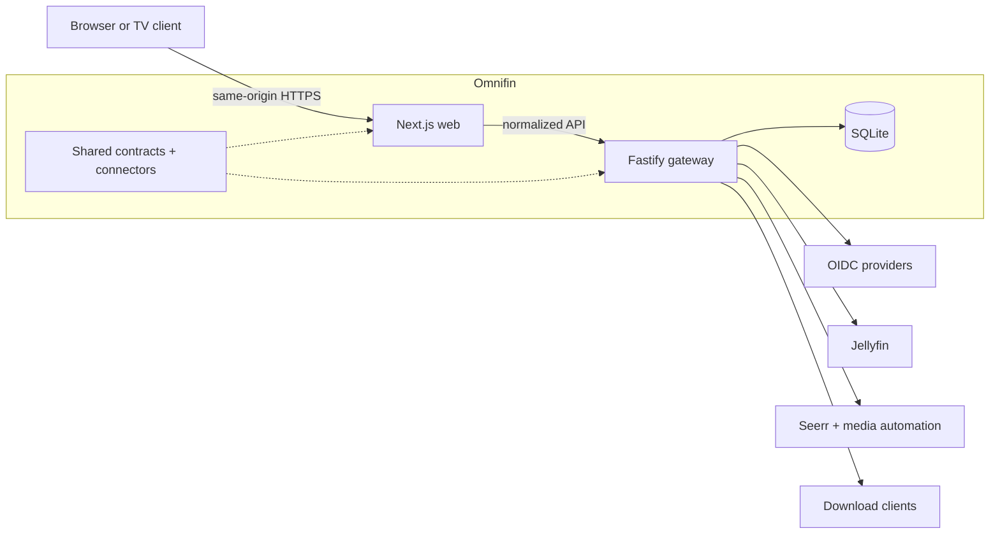

# Omnifin

**A cinematic control plane for a self-hosted media stack.**

Omnifin is an open-source web application for discovering, requesting, acquiring,
playing, and maintaining media without moving between a collection of unrelated
administration tools. It is designed around Jellyfin and the surrounding media
automation ecosystem, with the operational depth of a control room and the calm,
focused experience of a premium streaming product.

> [!IMPORTANT]
> Omnifin is pre-release software under active development. There is no stable
> production release yet, and configuration, storage, and API contracts may change.
> All `v0.x` releases are pre-v1 previews and are not supported as stable releases.
> V1 support remains pending the [v1 stability evidence gate](docs/v1-stability.md).
> Follow the [roadmap](docs/roadmap.md) for delivery status.

The verified public-project boundary and its required evidence are documented in
[foundation verification](docs/foundation-verification.md).

## Why Omnifin?

A capable home media stack often spans Jellyfin, Seerr, Radarr, Sonarr, Bazarr,
Prowlarr, and one or more download clients. Each service has its own interface,
credentials, permissions, failure states, and mental model. Omnifin is intended to
provide one deliberate experience across that system while preserving the useful
depth of each service.

The product is guided by three equal release requirements:

- **Complete workflows:** discovery, requests, acquisition, playback, and library
  operations should work end to end.
- **Defence in depth:** upstream administrator credentials stay on the server,
  every mutation is authorized locally, and sensitive actions are auditable.
- **Exceptional experience:** loading, empty, degraded, denied, error, and responsive
  states receive the same care as the happy path.

## Intended capabilities

The current roadmap covers:

- OIDC sign-in for providers such as Authentik, plus Jellyfin credentials and Quick
  Connect.
- Explicit, proof-of-control pairing between an OIDC identity and a Jellyfin user.
- Local `viewer`, `requester`, `operator`, and `admin` authorization independent of
  broad upstream API-key permissions.
- Unified discovery, search, requests, approvals, calendars, queues, and manual
  release selection.
- Jellyfin playback, watch progress, subtitle management, and library operations.
- One operator issue queue for in-player reports and Seerr issues, with guarded
  resolve and reopen decisions.
- Prowlarr indexer intelligence and title-level acquisition provenance.
- Capability-aware integration with Jellyfin, Seerr, Radarr, Sonarr, Bazarr,
  Prowlarr, qBittorrent, and SABnzbd.

These are target capabilities, not a claim that every workflow is available today.
See the [compatibility matrix](docs/compatibility.md) for validation status.

## Architecture at a glance

Omnifin keeps the browser simple and puts every privileged operation behind one gateway:



- **Web:** renders the interface and receives only normalized, role-filtered data.
- **Gateway:** owns sessions, permissions, credentials, connector traffic, media proxying,
  migrations, and audits.
- **Shared packages:** validate browser contracts and isolate version-specific upstream behavior.

The browser never connects directly to an upstream service. Each connector can fail independently,
so one degraded service does not have to collapse the rest of the application. The default Compose
deployment runs the web and gateway from one immutable image, with SQLite owned by the gateway.

Read the [architecture overview](docs/architecture.md) for trust boundaries and design decisions,
and the [roadmap](docs/roadmap.md) for current implementation status.

## Install a tagged release

Each verified tagged release publishes a small Compose bundle whose environment template is bound
to the exact multi-architecture image digest that passed the release gates. Open the
[latest verified release](https://github.com/rezanmz/omnifin/releases/latest), copy its exact tag
into `OMNIFIN_RELEASE` in place of `vX.Y.Z`, then download and verify its three assets. Keeping the
tag explicit makes installs and later rollbacks reproducible instead of silently following a moving
image tag.

```sh
OMNIFIN_RELEASE=vX.Y.Z
test "$OMNIFIN_RELEASE" != "vX.Y.Z" || {
  echo "Set OMNIFIN_RELEASE to the exact tag shown on the latest verified release page." >&2
  exit 1
}
install -d -m 0700 omnifin
cd omnifin
curl --fail --location --remote-name \
  "https://github.com/rezanmz/omnifin/releases/download/${OMNIFIN_RELEASE}/compose.yaml"
curl --fail --location --remote-name \
  "https://github.com/rezanmz/omnifin/releases/download/${OMNIFIN_RELEASE}/omnifin.env.example"
curl --fail --location --remote-name \
  "https://github.com/rezanmz/omnifin/releases/download/${OMNIFIN_RELEASE}/SHA256SUMS"
sha256sum --check SHA256SUMS
cp omnifin.env.example .env
chmod 0600 .env
```

Replace the example origins in `.env`, generate the two file-backed secrets, prepare the private
backup directory, and start the exact digest:

```sh
install -d -m 0700 secrets
umask 077
openssl rand -base64 32 | tr -d '\n' > secrets/omnifin_encryption_key
openssl rand -base64 48 | tr -d '\n' > secrets/omnifin_recovery_secret
chmod 0444 secrets/omnifin_encryption_key secrets/omnifin_recovery_secret
sudo install -d -m 0700 -o 65532 -g 65532 backups
docker compose --env-file .env --file compose.yaml pull
docker compose --env-file .env --file compose.yaml up --detach --wait
curl --fail --silent --show-error http://127.0.0.1:3000/healthz
curl --fail --silent --show-error http://127.0.0.1:3000/api/runtime
```

Compose bind-mounts local secret files without changing their host ownership, while the Omnifin
image runs as an unprivileged numeric user. The files are therefore read-only for every identity,
but other host users cannot traverse the `0700` directory to read them. Keep that directory owned
by the deployment account and do not loosen its permissions.

The web socket remains loopback-bound and the gateway is never published. Put a maintained TLS
reverse proxy in front of the web service before using secure cookies or OIDC. Continue with the
[reverse proxy runbook](docs/operations/reverse-proxy.md) for one-hop Caddy and Nginx examples and
an end-to-end verification checklist, then use the [first-run guide](docs/first-run.md) to create the
first administrator and rehearse a verified backup before adding irreplaceable configuration.
The public `/about` screen presents the same local runtime identity, exact corresponding source, and
light/dark/system appearance control without requiring a session or contacting an external service.

## Development preview

Prerequisites are Node.js, pnpm, and Docker with Compose. Contributors and source-checkpoint
reviewers can run Omnifin from source:

```sh
pnpm install --frozen-lockfile
cp .env.example .env
openssl rand -base64 32
openssl rand -base64 48
```

Place the 32-byte value in `OMNIFIN_ENCRYPTION_KEY` and the distinct 48-byte value in
`OMNIFIN_RECOVERY_SECRET` before starting. The example
environment file documents local-only defaults; do not reuse its settings for an
internet-accessible installation. The application processes do not load the root
environment file automatically, so export it into the development shell before
starting:

```sh
set -a
. ./.env
set +a
pnpm dev
```

Once both processes are healthy, open the private `/recovery` route. Establish the first
administrator through either a configured OIDC provider or fresh Jellyfin administrator proof;
the recovery-bound claim is single-use and replaces the short-lived recovery session atomically.
Set `OMNIFIN_JELLYFIN_URL` before starting when using the Jellyfin path. An OIDC administrator can
configure and administer the installation before pairing Jellyfin, but media access stays denied
until that explicit pairing succeeds. See the [first-run guide](docs/first-run.md) for both paths,
proxy requirements, and failure recovery.

See the [development guide](docs/development.md) for checks and repository conventions,
or the [deployment guide](docs/deployment.md) for the intended production model.

## Documentation

- [Architecture](docs/architecture.md) — components, trust boundaries, data, and
  failure handling
- [Runtime build identity](docs/runtime-identity.md) — local version, immutable source,
  release verification, privacy boundary, and support workflow
- [Authentication](docs/authentication.md) — OIDC, Jellyfin pairing, roles, sessions,
  and recovery
- [Invitations and onboarding](docs/authentication.md#administrator-invitations-and-onboarding) —
  administrator invite lifecycle, one-time sharing, OIDC/Jellyfin proof, and restore follow-up
- [Operator audit trail](docs/audit-trail.md) — privacy-safe security and operational history,
  authorization, pagination, retention, and troubleshooting
- [Discovery](docs/discovery.md) — normalized Seerr search, media intelligence, person
  context, permissions, errors, and browser behavior
- [Media requests](docs/media-requests.md) — delegated Seerr identity, idempotency,
  normalized mutations, and audits
- [Media issues](docs/media-issues.md) — normalized player and Seerr issue lifecycle,
  opaque references, partial failure, and idempotent decisions
- [Media library](docs/media-library.md) — user-scoped Jellyfin catalogue, opaque pagination,
  playback references, and privacy boundaries
- [Saved titles and private lists](docs/saved-lists.md) — Watch Later, Jellyfin favorites,
  personal lists, reconciliation, concurrency, and privacy boundaries
- [Playback preferences](docs/playback-preferences.md) — private semantic language, subtitle,
  accessibility, and network-quality defaults
- [Acquisition provenance](docs/acquisition-provenance.md) — live normalized Radarr
  and Sonarr title history, bounded fallback, partial failure, and operator access
- [Acquisition monitoring](docs/acquisition-monitoring.md) — exact-title Radarr and
  Sonarr state controls, safe mutation boundaries, and audits
- [Indexer Intelligence](docs/indexer-intelligence.md) — normalized Prowlarr
  telemetry, application sync, failures, and safe tests
- [Download queues](docs/download-queues.md) — normalized qBittorrent and SABnzbd
  telemetry, exact-item pause/resume/removal, auditing, partial failure, and secret isolation
- [System health](docs/system-health.md) — normalized Servarr warnings, private
  storage capacity, partial failure, and freshness behavior
- [Isolated service fixtures](docs/operations/servarr-service-fixtures.md) — digest-pinned
  Radarr, Sonarr, Prowlarr, and Bazarr development evidence
- [Acquisition calendar](docs/acquisition-calendar.md) — normalized Radarr and Sonarr
  release timing, pagination, partial failure, and privacy boundaries
- [Design quality](docs/design-quality.md) — the visual, interaction, accessibility,
  and performance bar
- [Compatibility](docs/compatibility.md) — service targets and verification policy
- [V1 stability](docs/v1-stability.md) — authoritative stable scope, evidence tiers,
  and go/no-go gate
- [Deployment](docs/deployment.md) — secrets, TLS, backups, upgrades, and rollback
- [Reverse proxy](docs/operations/reverse-proxy.md) — loopback-only Caddy and Nginx TLS patterns,
  trusted hops, live events, and public verification
- [Deployment doctor](docs/operations/deployment-doctor.md) — a privacy-safe runtime, HTTPS, storage,
  and backup-directory preflight from the immutable image
- [Stack verification](docs/operations/stack-verification.md) — fresh administrator-run OIDC and
  connector checks with a privacy-safe JSON report
- [First run](docs/first-run.md) — source/Compose startup and first-administrator bootstrap
- [Development](docs/development.md) — local setup, checks, and contribution workflow
- [Roadmap](docs/roadmap.md) — phased delivery and release gates
- [Release process](docs/release-process.md) — versions, images, provenance, and
  verification
- [Security model](docs/security-model.md) — assets, threats, and security invariants

## Community and support

Use [GitHub Discussions](https://github.com/rezanmz/omnifin/discussions) for questions,
ideas, and setup conversations. Use
[GitHub Issues](https://github.com/rezanmz/omnifin/issues) for reproducible defects and
scoped feature proposals. Please read [SUPPORT.md](SUPPORT.md) and
[CONTRIBUTING.md](CONTRIBUTING.md) before opening a report or pull request.

Security vulnerabilities must be reported privately according to
[SECURITY.md](SECURITY.md), never in a public issue.

## License

Omnifin is licensed under the
[GNU Affero General Public License v3.0 only](LICENSE) (`AGPL-3.0-only`). If you run a
modified version for users over a network, the license requires you to offer those
users the corresponding source code for that version.

Omnifin is an independent project. Product names and trademarks belong to their
respective owners; integration does not imply endorsement.
