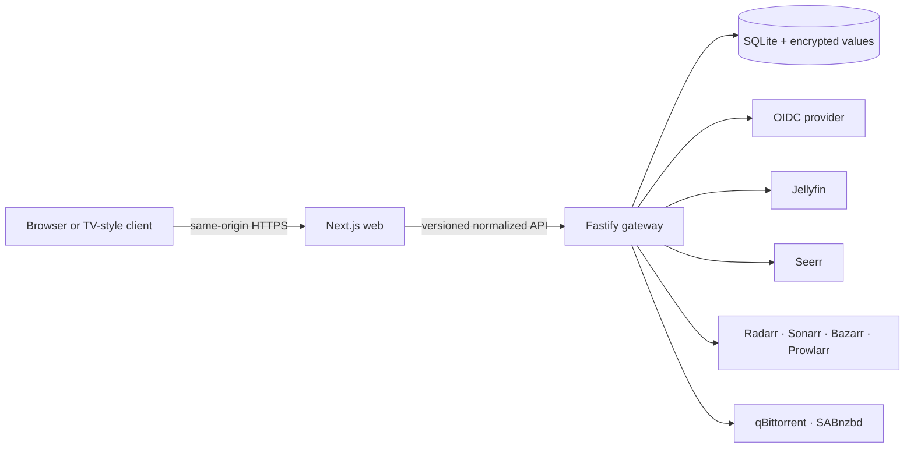

# Architecture

This document gives operators and contributors the system model needed to assess a
deployment, trace a request, or change a subsystem without weakening its boundaries.
It describes the target architecture for the current pre-release implementation;
the roadmap records when each area has passed its verification gate.

> [!IMPORTANT]
> Phase 0 established the process topology, SQLite migrations, health and readiness,
> security headers and origin checks, connector contracts and probes, secret-handling
> primitives, and the interface shell. Identity and dashboard release verification remains active:
> OIDC sign-in, local
> sessions, direct Jellyfin password and Quick Connect sign-in, identity resolution,
> password and Quick Connect OIDC-to-Jellyfin pairing, self-service link lifecycle,
> authentication audits, recovery access, and encrypted OIDC provider lifecycle and role-mapping
> administration now exist through both normalized APIs and permission-checked control rooms.
> Encrypted connector administration, normalized Seerr discovery, the first
> identity-delegated, idempotent Seerr request mutation, and permission-gated read-only
> Radarr/Sonarr acquisition provenance, exact-target search recovery, and Prowlarr
> Indexer Intelligence are implemented. Exact-target manual release search and grabs plus
> normalized qBittorrent/SABnzbd queue reads are also implemented; request review,
> calendar controls, broader acquisition mutations, and media proxying remain incomplete.
> The implemented API surfaces enforce their local role or narrowly scoped recovery
> permissions at both route and service boundaries. The roadmap, not branch availability,
> determines supported-release status.

## Current implementation checkpoint

The browser renders the application and sign-in shells, reaches the web process's own
liveness endpoint, and loads versioned provider metadata through the same-origin web
process. Ready OIDC providers can complete the authorization-code flow and create a
local session; failed or inconsistent providers remain non-interactive. Gateway
liveness and storage readiness stay private to the Compose network. The gateway owns
OIDC discovery and backoff, one-time authorization transactions, identities, individually
and account-wide revocable sessions,
direct Jellyfin password and Quick Connect exchanges, recovery access, and authentication audits. It
also migrates SQLite, validates public configuration, redacts structured logs, and
provides isolated connector fixture and probe tooling.

The provider-administration boundary can create, list, replace, freshly validate, and safely delete
encrypted, audited OIDC records and can list, create, and delete exact role mappings. Its browser
control room exposes only normalized secret-free records, reserves exact provider endpoints before
creation, and requires validation before offering enablement.
Direct Jellyfin password and Quick Connect login plus link status, both relinking methods, revocation, and
account-wide local logout are implemented for the deployment-configured connector.
RP-initiated and provider-initiated back- and front-channel OIDC logout are implemented.
Encrypted connector administration is available through a versioned, permission-checked API;
recovery sessions see and repair only Jellyfin connector records. A pinned isolated Authentik
environment verifies authorization, role mapping, RP logout, and back-channel logout, while a
protected public compatibility baseline remains pending. The connector browser control room,
normalized Seerr search, media-request creation, and title-level Radarr/Sonarr provenance are
available as pre-release development surfaces. Prowlarr inventory, 24-hour statistics,
disabled state, application sync, normalized failures, and exact-target safe tests are
also available through the operator-only Indexer Intelligence workspace. An operator-only
download workspace reads bounded, normalized qBittorrent and SABnzbd queues without exposing
upstream identifiers or credentials. Request review, calendar controls, broader acquisition
mutations, and playback remain unavailable.

## Target system shape

Omnifin is a TypeScript monorepo with three kinds of module:

1. A **Next.js web application** renders the interface and serves browser assets.
2. A **Fastify gateway** is the only process allowed to handle credentials, sessions,
   authorization decisions, connector traffic, media proxying, and audit writes.
3. **Shared packages** define validated contracts, connector capabilities, and the
   design system used by both applications.

The intended release image contains both application entry points. Docker Compose
starts a stateless web service and a stateful gateway service from the same image
digest. The gateway owns the SQLite volume. This keeps the default deployment simple
while ensuring the two processes cannot drift between versions.

The production stage is a digest-pinned distroless Node image. It runs as the numeric
non-root identity `65532:65532` and contains neither a shell nor a package manager;
build tools and npm remain confined to disposable build stages. Health checks and the
two application roles execute Node through absolute paths, so the hardened runtime
does not depend on shell interpretation.

## Required trust boundaries

### Browser boundary

The browser is untrusted. It receives normalized, role-filtered data and opaque
session state, never upstream API keys, Jellyfin access tokens, OIDC assertions, or
raw connector responses. Every mutation is independently authorized by the gateway;
hiding a control in the interface is not an authorization decision.

### Gateway boundary

The gateway is the security boundary. It validates input with shared schemas,
checks the request origin and CSRF token, loads the server-side session, applies
local permissions, calls an approved connector destination, normalizes the result,
and records sensitive actions. Logs are structured and redact secrets, assertions,
cookies, tokens, and media paths.

### Connector boundary

Each upstream service is independently fallible and may expose version-specific
behavior. A connector advertises discovered capabilities rather than assuming that
every endpoint exists. Timeouts, invalid credentials, permission errors, and
unsupported capabilities are typed outcomes. One failed service must not collapse an
otherwise useful dashboard.

Connector destinations are administrator-approved. URL validation rejects embedded
credentials, unexpected redirects, and loopback, link-local, or cloud-metadata
targets unless a narrowly scoped local-network policy explicitly permits the target.
Insecure HTTP requires a visible administrative opt-in. Self-signed HTTPS requires a
connector-specific trusted CA certificate and retains certificate and hostname verification.

## Required authenticated request lifecycle

A typical authenticated request follows this sequence:

1. The browser sends an opaque session cookie. A state-changing request also sends a
   CSRF token and an expected same-origin header.
2. The gateway resolves the session by a one-way token digest and applies inactivity
   and absolute expiry.
3. The route checks a named local permission derived from the principal's role and
   linked-service state.
4. The connector layer selects only capabilities verified for the configured
   service version.
5. The upstream response is parsed and transformed into a versioned Omnifin
   contract. Unknown upstream fields do not cross the gateway boundary.
6. Security-relevant decisions and mutations produce an audit record with a request
   correlation identifier.

Live data uses server-sent events or bounded polling behind the same session and
authorization checks. Clients reconcile updates through normalized query keys; they
do not open connections directly to upstream services.

## Phase 1 identity and authorization

The current checkpoint supports configured OIDC issuers, immutable issuer-and-subject
identity keys, explicit claim-to-role mapping, viewer-default JIT provisioning, opaque
sessions, and recovery access. Direct Jellyfin authentication and the user-controlled
password and Quick Connect pairing paths and the self-service link lifecycle are
implemented. Media access requires a
separately proven Jellyfin account link; matching email addresses is never sufficient
proof. The full flow and recovery model are documented in
[Authentication](authentication.md).

The shared contract defines `viewer`, `requester`, `operator`, and `admin` roles. Phase
1 permission evaluation must remain local to Omnifin because most upstream service
keys are effectively administrative. Connector credentials must not determine the
signed-in user's authority.

## Persistence schema and secrets

The SQLite schema stores or reserves storage for:

- users, external identities, service identity links, and role mappings;
- opaque session digests, short-lived authentication transactions, and bounded OIDC
  logout replay receipts;
- connector configuration and capability snapshots;
- encrypted Jellyfin tokens and connector credentials;
- durable audit records and persisted failure state; and
- schema migration history.

Current OIDC, direct Jellyfin, recovery, and provider-administration workflows create authenticated users,
external identities, service identity links, encrypted Jellyfin tokens, sessions,
authorization transactions, connector bootstrap records, and authentication audit
events. OIDC provider client secrets are encrypted and provider creation is audited in
the same transaction. Administrative validation uses the same SSRF-resistant discovery and
capability checks as sign-in, exposes no endpoints or runtime security seals, supports safe
validation while disabled, and records bounded success or failure audits. Password and Quick
Connect pairing, normalized link health,
relinking, revocation, and account-wide local session logout are available. Connector records can
be created, listed, inspected, validated, revised, enabled, disabled, and safely deleted through
`/v1/admin/connectors`; credentials remain encrypted, every mutation is audited, and material
changes invalidate the capability snapshot. Signed provider back-channel logout can revoke an
exact OIDC session or immutable external identity without storing the raw Logout Token.
Session-aware front-channel logout can revoke an exact provider-scoped session while
restricting iframe access to the validated issuer origin. Raw `sid` and `jti` values
are not persisted.

Role-mapping mutations are serialized with sanitized audit writes and session revocation. A
change invalidates active authority derived from the affected provider's default or mapped role;
manual roles and recovery sessions are not changed. Mapping resolution remains deterministic by
priority and denies ambiguous highest-priority roles.

Provider replacement resets discovery evidence and pending authorization transactions whenever
runtime inputs change, then revokes active OIDC sessions for that provider. Linked issuer changes
are rejected. Provider deletion is restricted to disabled records without external identities, so
the operation cannot silently orphan or relink an account.

When product workflows begin writing sensitive values, they must use authenticated
encryption with a deployment-provided master key. The key must never be stored in the
database. Changing it requires an explicit key-rotation procedure; losing it makes
encrypted connector credentials unrecoverable.

SQLite has a single writer. The gateway owns migrations and serialized writes, uses
WAL mode where supported, and reports readiness only after storage and migrations are
healthy. Horizontal gateway scaling is intentionally outside the first deployment
profile.

## Current shell and target frontend architecture

The web application provides server-rendered route shells, deterministic preview data,
responsive navigation, a live provider-driven sign-in screen, secure Jellyfin pairing,
and an account-and-access center with exact loading, unconfigured, unavailable, denied,
and error states. A keyboard-, touch-, and directional-navigation-ready global search console reads
only normalized Seerr discovery results and deliberately covers prompt, loading, empty, offline,
permission-denied, signed-out, rate-limited, and responsive states. These surfaces use only the
same-origin API boundary. A lazy-loaded signal-history drawer reads normalized, operator-only
Radarr/Sonarr history and queue evidence with complete, degraded, empty, loading, offline,
permission-denied, responsive, light, and dark states. As media workflows arrive,
The download workspace uses TanStack Query for abort-aware polling, explicit refresh, and
last-verified degraded rendering. TanStack Query owns remote data and invalidation, while Zustand remains limited to
ephemeral interface state such as an open drawer or command-palette context. Motion is
reserved for purposeful, interruptible transitions; reduced-motion users receive
stable state changes without decorative movement.

Heavy surfaces—the theater player, expanded calendar, and administrative tools—will be loaded
on demand when implemented; the manual release workbench is already lazy-loaded. Reusable components
are exercised in Storybook across normal, loading, empty, offline, error, denied, and
responsive states before route assembly.

## Required partial failure model

An upstream outage is expected operating state, not an exceptional blank screen.
Each connector reports health and last successful contact independently. The gateway
returns useful data alongside typed degraded-service information where safe. The
interface preserves the last known view only when its age and provenance are clear,
and disables actions whose outcome cannot be guaranteed.

Later-phase failures that require intervention must be persisted with timestamps,
affected service, correlation identifier, safe diagnostics, retry state, and
resolution. Each process has a `/healthz` liveness endpoint. The gateway's private
`/readyz` endpoint additionally reports storage and migration readiness. Neither
gateway endpoint returns secrets or private service details, and the web process does
not proxy storage readiness to the public network.

## Required deployment invariants

- Production traffic terminates TLS before reaching the web service.
- The public proxy sanitizes the forwarding chain, and the web trusted-hop count
  exactly matches the maintained proxies that cannot be bypassed.
- The gateway is not exposed directly to untrusted networks.
- One release uses one immutable image digest for both services.
- The SQLite database and master key are backed up separately and restored together.
- Telemetry is disabled by default; Omnifin makes no analytics or phone-home requests.
- The interactive interface exposes the running version, license notice, and a
  corresponding-source link for the deployed version.
- An upgrade begins with a verified backup and uses versioned migrations.
- A rollback selects a previously verified version or digest; published artifacts
  are never overwritten.
